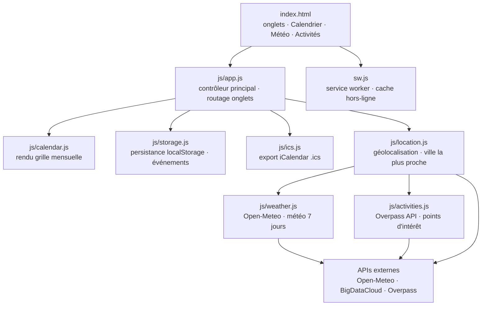

# 📅 Mon Calendrier · PWA

<!-- adam-badges:start -->
[](https://github.com/Adam-Blf/Application-Calender/commits)
[](https://hits.sh/github.com/Adam-Blf/Application-Calender/)
[](https://github.com/Adam-Blf/Application-Calender/commits)
[](https://github.com/Adam-Blf/Application-Calender)
[](LICENSE)
<!-- adam-badges:end -->

Application web progressive (PWA) pour **enregistrer vos dates**, découvrir des
**activités dans la grande ville la plus proche** et consulter la **météo**.

## Architecture



## Fonctionnalités

- **Calendrier mensuel** : naviguez de mois en mois, sélectionnez un jour, voyez vos événements d'un coup d'œil (pastilles).
- **Événements** : titre, date, heure, lieu et notes. Stockés localement sur votre appareil (aucun compte requis).
- **Export `.ics`** : exportez tous vos événements et importez-les dans Google Agenda, Apple Calendrier, Outlook, etc.
- **Météo** : conditions actuelles + prévisions sur 7 jours pour votre position.
- **Activités à proximité** : suggestions (tourisme, loisirs, restaurants, divertissement) dans la grande ville la plus proche, ajoutables directement à l'agenda en un clic.
- **Installable & hors-ligne** : installez l'app sur l'écran d'accueil ; l'interface reste accessible sans connexion (les données live nécessitent le réseau).

## Services utilisés (gratuits, sans clé API)

- **Météo & géocodage** : [Open-Meteo](https://open-meteo.com/)
- **Reverse geocoding** : [BigDataCloud](https://www.bigdatacloud.com/)
- **Activités / points d'intérêt** : [Overpass API — OpenStreetMap](https://overpass-api.de/)

## Lancer l'application

Une PWA doit être servie en HTTP(S) (pas en `file://`) pour que le service
worker et la géolocalisation fonctionnent.

```bash
# Avec Python
python3 -m http.server 8080

# ou avec Node
npx serve .
```

Puis ouvrez http://localhost:8080 dans votre navigateur. Sur mobile, utilisez
HTTPS (par ex. via un déploiement statique) pour autoriser la géolocalisation.

## Structure

```
index.html              Interface (onglets Calendrier / Météo / Activités)
css/style.css           Styles
js/storage.js           Persistance locale des événements (localStorage)
js/ics.js               Génération de fichiers iCalendar (.ics)
js/location.js          Géolocalisation + recherche de la grande ville la plus proche
js/weather.js           Récupération et formatage de la météo
js/activities.js        Recherche d'activités via OpenStreetMap
js/calendar.js          Rendu de la grille du calendrier
js/app.js               Contrôleur principal
manifest.webmanifest    Manifest PWA
sw.js                   Service worker (cache hors-ligne)
icons/                  Icônes de l'application
```

## Confidentialité

Vos événements ne quittent jamais votre appareil : ils sont stockés dans le
`localStorage` du navigateur. Votre position n'est utilisée que pour interroger
les services météo/activités et n'est pas conservée.


## Star History

<a href="https://www.star-history.com/?repos=Adam-Blf%2FApplication-Calender&type=date&legend=top-left">
 <picture>
   <source media="(prefers-color-scheme: dark)" srcset="https://api.star-history.com/chart?repos=Adam-Blf/Application-Calender&type=date&theme=dark&legend=top-left" />
   <source media="(prefers-color-scheme: light)" srcset="https://api.star-history.com/chart?repos=Adam-Blf/Application-Calender&type=date&legend=top-left" />
   
 </picture>
</a>
